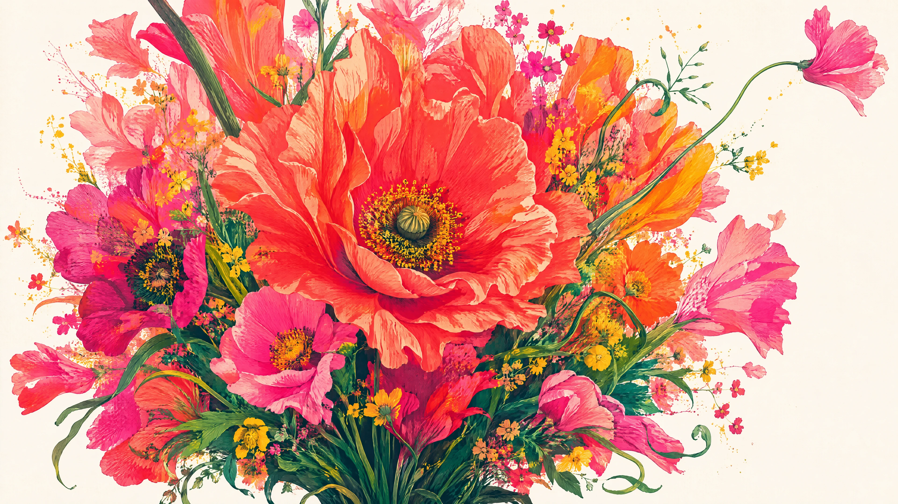
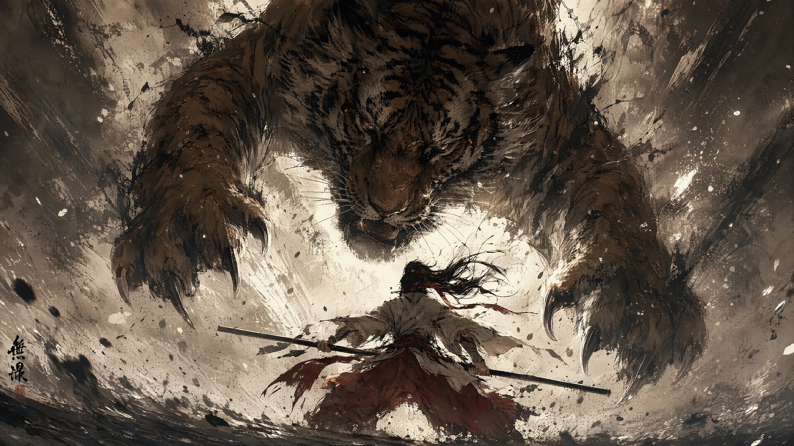

# VELA

> 图像是正面，prompt 是背面。

VELA 是一份 AI 视觉作品档案。

每件作品都将最终图像与促成它的原始生成指令并置保存：正面观看画面，背面阅读构图、
材质、光色与叙事意图。这里记录的不只是结果，也包括一幅图像如何被描述、约束与生成。

[进入 VELA](https://sweetretry.github.io/vela/)

## Archive

| 001 | 002 |
| :--- | :--- |
|  |  |
| **挣脱盛放 · UNBOUND BLOOM** 从紧束的深绿根部向外爆发。花冠不是被摆放的静物，而是一股正在越过画框的生命冲动。 | **无根 · ROOTLESS** 猛虎从上方压迫画面，武士以低姿态横棍迎击。暖棕、墨黑与局部朱红把空间压缩成一记正在爆发的水墨笔触。 |
